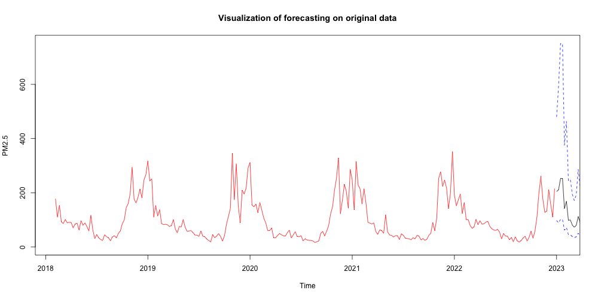
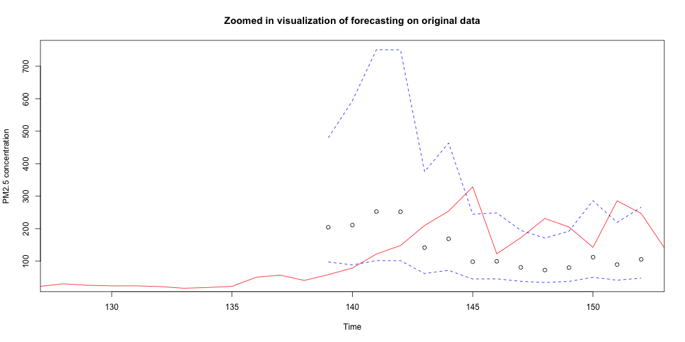

# Forecasting Weekly PM2.5 Levels in Delhi

### Project Overview
This project forecasts weekly PM2.5 levels in Delhi using time series analysis in R. The goal is to capture seasonal trends, model pollutant behavior, and generate a 14-week forecast using ARMA modeling.

### Tools and Packages Used
- R and RStudio
- Packages: xts, lubridate, dplyr, forecast, MASS, tseries, ggplot2

### Dataset
The analysis uses the Kaggle dataset: ['Time Series Air Quality Data of India (2010-2023)'](https://www.kaggle.com/datasets/abhisheksjha/time-series-air-quality-data-of-india-2010-2023?resource=download&select=DL019.csv)  
- File used: DL019.csv 
- Original data is hourly PM2.5 measurements in Delhi from February 5, 2018, to March 31, 2023  
- Columns used:
  - Time: timestamp of the measurement
  - PM2.5: PM2.5 concentration (micrograms / meters^3)  

The data was aggregated to weekly averages to perform time series analysis.

### Analysis Performed
- Data Cleaning: removed missing values, standardized timestamp, aggregated to weekly data  
- Exploratory Analysis: plotted weekly PM2.5, identified seasonal patterns (2 peaks per year: late-fall & mid-winter)  
- Stationarity & Transformation: Box-Cox transformation, first-order and seasonal differencing  
- Model Selection: ARMA(2,1) and ARMA(5,1) models evaluated using AICc, ACF/PACF, residual diagnostics, Shapiro-Wilk, and Box-Ljung tests  
- Forecasting: 14-week forecast generated with ARMA(5,1) using adjusted confidence intervals to account for transformations  

### Key Visualizations
#### Weekly PM2.5 Concentration in Delhi:
This plot shows the weekly PM2.5 levels in Delhi, highlighting the seasonal patterns and spikes in mid-winter and late-fall.

#### 14 Week Forecast on Original Data:
This plot shows the ARMA(5,1) 14-week forecast along with confidence intervals, overlaid on the original data.

#### Zoomed-In Forecast:
Same as the 14 Week Forecast plot but zoomed in on the forecasts.

### Key Findings
- ARMA(5,1) was chosen for forecasting due to better residual diagnostics, despite a slightly higher AICc than ARMA(2,1)  
- The forecast captured seasonal trends, including late-winter to early-spring declines and mid-winter pollution spikes  
- Adjustments to the confidence intervals were necessary due to negative Box-Cox lambda and prior differencing  
